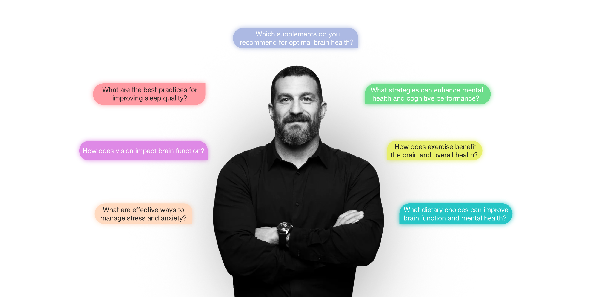
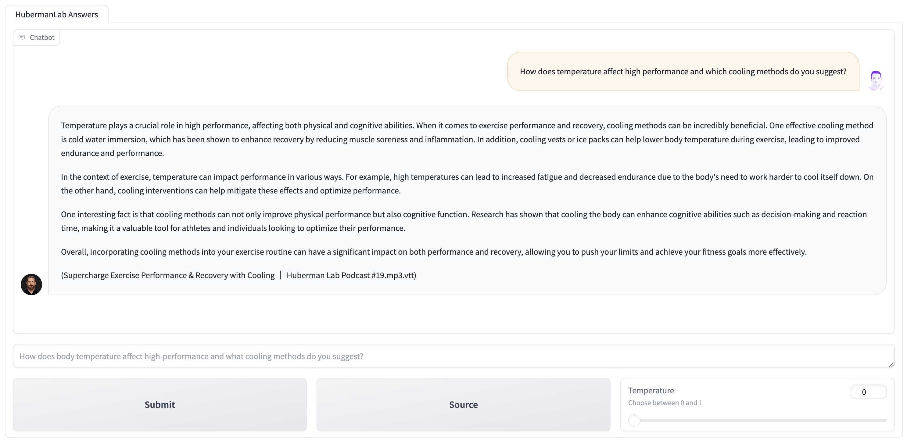

# Huberman Answers
If you’re looking for a quick answer into the topics discussed on the [HubermanLab Podcast](https://www.hubermanlab.com/) but don’t have time to listen to full episodes, you’ve come to the right place. This chatbot is a `RAG-GPT` system with `OpenAI's GPT 3.5 Turbo`, `Langchain`, `ChromaDB`, and `Gradio`, delivers pinpoint answers to your questions. 

Submit your question and get insights on neuroscience, biology, and human performance directly from Dr. Andrew Huberman’s discussions.
Each answer comes with the name and number of the podcast episode if you want to watch it.

## Interface


## Data
This project utilizes `.vtt` transcripts from the Huberman Lab podcast, originally transcribed by Marko Simic. 
You can find his project [here](https://www.simicvm.com/hubcap/).

Transcripts are stored in the data directory `data/docs`: For files that should be processed in advance.
Vector database (VectorDB) is generated within the data folder for the project's functionality.

### Data Acquisition
* Episodes were downloaded using the [yt-dlp](https://github.com/yt-dlp/yt-dlp) tool.
* The obtained audio files were transcribed using OpenAI's [Whisper](https://github.com/openai/whisper) `medium.en model`.

## Usage
To run the projects, you will need to follow these steps to get started:

1. Clone the repository and navigate to the project directory:
```python 
git clone https://github.com/NinoRisteski/HubermanAnswers.git
cd hubermananswers
```
2. Create a new virtual environment using a tool like virtualenv or conda, and activate the environment:
```python
conda create --name hubermananswers python=3.9.6
conda activate hubermananswers
```
3. Install the requirements:
```python
pip install -r requirements.txt
```
4. Open `app_config.py` and fill in your OpenAI API credentials.
5. Run `upload_data_manually.py` to process data and create `vectordb`:
```python
python3 src/upload_data_manually.py
```
*Only initially to process the transcripts. No need to run in every time you run the app.*

6. Run the Application:

* In Terminal 1:

```python
python3 src\serve.py
```
The `serve.py` module hosts the .vtt files in a server, making them accessible for user viewing. 

* In Terminal 2:

```python
python3 src\hubermananswers_app.py
```
*Don't forget to activate the environments in each terminal*

7. Finally, ask Huberman from simple to complex questions and recieve a thoughtful answers along with the episode titles.

## Credits 
### Special Thanks
[Marko Simic](https://www.simicvm.com/)
* For creating the Huberman Lab transcripts dataset.
        
[Emanuel Risteski](https://www.linkedin.com/in/emanuelristeski/)
* For creating the visuals for the project.

Photo Credits: 
* The main photo of Andrew Huberman is not mine. All credits go to [Huberman Lab.](https://www.hubermanlab.com/)

## Contact
If you liked this project, feel free to reach out on [X](https://twitter.com/ninoristeski) or [LinkedIn](https://www.linkedin.com/in/nino-risteski/).